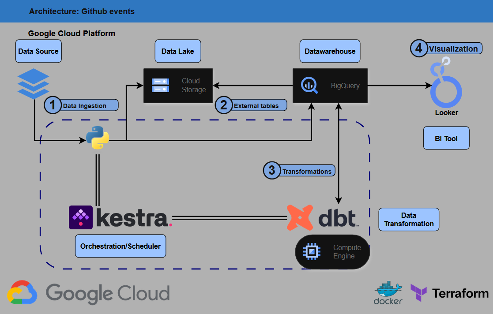
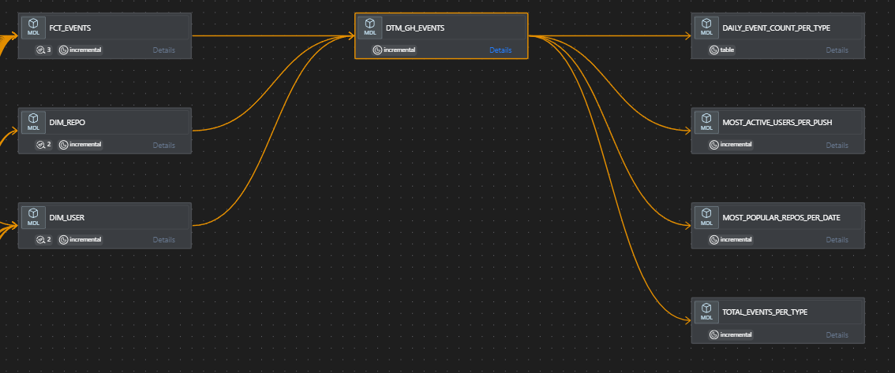
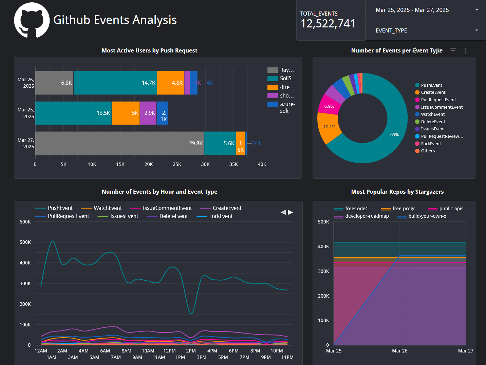
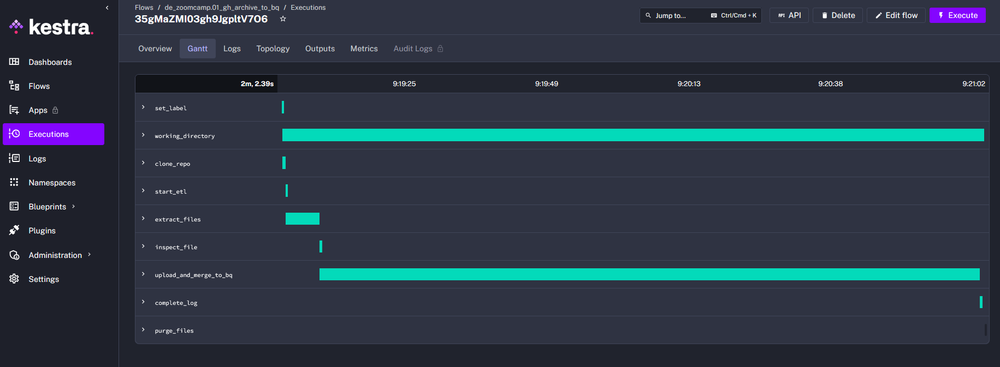
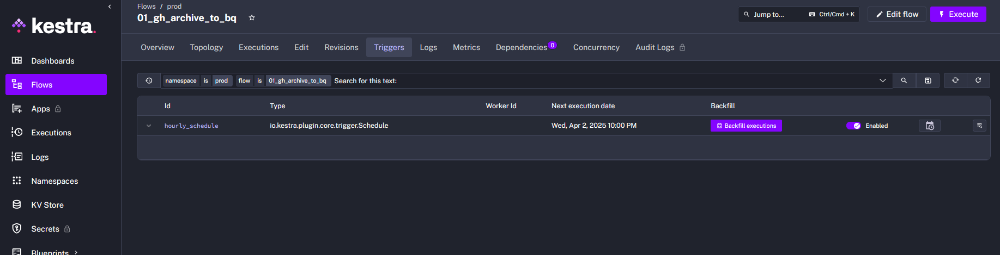
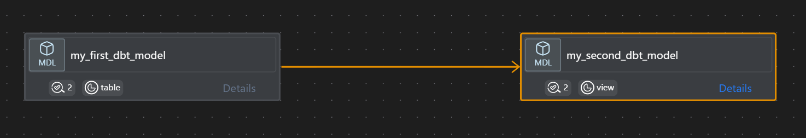

# de-github-events-pipeline

This project is part of DataTalkClub's data engineering zoomcamp. [click here to visit the repo](https://github.com/DataTalksClub/data-engineering-zoomcamp/)


## Evaluation Criteria

* Problem description
* Cloud
* Data ingestion (choose either batch or stream)
    * Batch / Workflow orchestration
* Data warehouse
* Transformations (dbt, spark, etc)
* Dashboard
* Reproducibility

# Problem description 

The objective of this project is to create a data pipeline using data from [github archive](https://www.gharchive.org/). This archive is an open source dataset to record the public github timeline so it can be easily accessed by developers for analysis. 

The goal is to generate a dataset from the info retrieved out of the archive and generate a dashboard to obtain some insights about the general activity in github. The data consists of various types of events, ranging from `push`, `pull` to `watch` events.

Throughout this project, a data pipeline will be set up from beginning to end, including data extraction and storage into a datalake, ingestion into a datawarehouse handling duplicates and performing various transformations, as well as creating facts and dimension tables to feed a final consumption view which will be utilized in a dashbord.

This will involve using GCP as the cloud provider, with terraform to create necessary infrastructure, kestra to orchestrate the jobs and dbt to handle the data transformations in the datawarehouse, which in this case is bigquery.

# Technologies

Although briefly summarized in the project description, here are the technologies used throughout the project:

| **Component**              | **Description**                                                                 |
|----------------------------|---------------------------------------------------------------------------------|
| **INFRASTRUCTURE**         | Terraform as a means to manage the project's infrastructure                     |
| **DATA LAKE**              | Google Cloud Storage for the raw files                                         |
| **DATA WAREHOUSE**         | Google BigQuery                                                                |
| **DATA TRANSFORMATION TOOL** | dbt core for data modeling                                                    |
| **ORCHESTRATION**          | Self-hosted Kestra                                                             |
| **COMPUTE ENGINE**         | GCE to run the scheduled data pipelines                                        |
| **BI TOOL**                | Looker Studio to generate a simple dashboard                                   |
| **CONTAINERS**             | Docker and Docker-compose to facilitate reproducibility                        |
| **SET UP**                 | MAKE as a tool to facilitate some common tasks to set up and run commands      |

# Pipeline architecture



The image above describes the architecture used for the project, as mentioned before the main components are created through terraform resources. Let's cover in more detail the various elements:

## Data ingestion

As mentioned in the problem statement, the data source is from the github archive website, the link can be found [here](https://www.gharchive.org/). These files are `Newline Deimited JSON` files that are compressed in a `.gz` format. 

The ingestion itself occurs in a compute engine virtual machine that runs Kestra and uses a [python script](process_gh_archive_events.py) to:

* Downlod the files
* Separate them by event type
* Creates external Bigquery tables pointing to the bucket uri of the file just processed
* It ensures that there are staging tables in Bigquery as well and prepares a dynamic merge statement from the external tables to the staging tables

From here on, the data is in Bigquery and ready to be processed by DBT.

## Transformations

Transformations are done in DBT core. This is also running in the compute engine virtual machine. 

The transformations can be seen in the [dbt](dbt/gh_events/) folder. They consist of a staging or data preparation layer, I've prepared some dbt macros for some of the fields which are repeated along the various event types. I will mention more about it later, but here I wanted to explore and exploit further the payloads for the various event types, but I didn't find as much as I wanted, so decided to keep it simple in most of them. 

In the core layer I prepared some fact and dimension tables and a datamart integration. Lastly, there are consumption views with some tables containing metrics in a format that would be easy to dashboard.




Where applicable, I have used incremental models that are also partitioned and clustered according to how the data is likely to be used. I've added to the data an audit field with the `load timestamp` which will indicate dbt that the data has been newly introduced and it should be processed. The main reason for this is to facilitate backfills, I think it is likely that one might want to load older data than what has already been loaded. Using only the `created at` field on the incrementals, would make it so that older data that has been recently ingested is ignored. 

Either way, since the data will most likely be queried by `created at`, this is the field used to partition the data most of the time. In general, we are using `merge` incremental strategy indicating a unique key, though I did play arround with `insert overwrite` which is more performant, but didn't find it suited my use case to fully replace partitions, as I am not always fully processing partitions. 

Additionally, I've added a few basic data tests to be evaluated whenever the dbt models are run. 

Finally, I've designed a simple dashboard in Looker studio to present the data:



The dashboard itself shows a few views I found interesting and it also has a couple of options to filter the data, such as a data range and the event type. Keep in mind not all tiles are affected by the event type.

# Workflow details

Let's talk a bit aout some of the workflow details and decisions, including maybe improvement avenues:

One thing to mention is that the events have a different schema depending on their type. My original intention was to play around with this and use libraries such as [this one](https://pypi.org/project/bigquery-schema-generator/) to determine the schema and compare it with the autodetect function included in bigquery. Basically, autodetect was not working too well in here, because it will only read a given amount of records to make their estimate, while the library will make a more thorough examination to make their estimate. In any case, the schema can change over time, which is another consideration.

Since my plan was to allow backfilling as well, I figured I'd include the option to only process specific event types. In fact, I was thinking about diving deeper in some of the more well known event types and maybe not using some of the lesser known ones. However, after some extra data exploration, I decided to keep it simpler for this shorter project and leave the door open for improvement.

So, current solution: it uses a JSON [schema file](kestra/schema.json) that simply considers the specific payload for each event as a json string to accommodate any schema provided by the different event types. But still I am separating by event type, as I will likely implement backfilling for specific event types.

## Working with kestra and scheduling

In the directory for [kestra files](kestra/) there are a few flows, with two main ones and a couple of utility flows. The main flows are:

1. [gh_archive_to_bq](kestra/01_gh_archive_to_bq.yml)

This is the flow in charge of ingesting data into bigquery. it is using the `working directory` plugin, since various tasks can use the files in it without having to do much about output and input files for each task. Also another benefit is that it only keeps the files for the session and I didn't see a reason to keep the files after they have been uploaded to the datalake and datawarehouse. 

In terms of scheduling, the flow can work both by executing it manually and passing along inputs or it can also be run through a schedule including backfills and it will automatically pick up the corresponding values for what the inputs should be. The image below shows what a run looks like from the UI



2. [gcp_dbt](kestra/02_gcp_dbt.yml)

The next important flow is the one in charge of running the dbt transformations. This is not a particularly complicated flow, it is able to connect to the bigquery instance and run a dbt debug or dbt build command depending on the input. 

Apart from these two, there are also two other flows that are more of utilities. The first one [gcp_kv](kestra/00_gcp_kv.yml) is mainly used for set up, and it generates variables in the key-value store, which is a handy tool from kestra to keep some general credentials available for a namespace. I'll talk about it in a later section, but it basically uses environment variables to introduce these to kestra in a safe way.

The second utility flow is [push_to_git](kestra/00_push_to_git.yml) which is self explanatory. It is used to push flows into a git repo, it is useful when working from the kestra UI as an automatized way to put those changes in version control without manual steps or copy and pasting. 

Although it is fairly easy to run things from the UI, there is also the option to run kestra jobs through its API. Here are a couple of examples:

* To create a flow from a local file

```
curl -X POST http://localhost:8080/api/v1/flows \
     -H "Content-Type: application/x-yaml" \
     --data-binary @kestra/00_gcp_kv.yml
```

* To run a flow with inputs

```
curl -X POST http://localhost:8080/api/v1/executions/de_zoomcamp/01_gh_archive_to_bq \
      -F branch="develop" \
      -F events_date="2020-01-02" \
      -F events_hour="0"
```

* We can also run a backfill

```
curl -X PUT http://localhost:8080/api/v1/triggers -H 'Content-Type: application/json' -d '{
  "backfill": {
    "start": "2024-03-28T06:00:00.000Z",
    "end": "2024-03-28T08:00:00.000Z",
    "inputs": null,
    "labels": [
      {
        "key": "backfill",
        "value": "true"
      }
    ]
  },
  "flowId": "01_gh_archive_to_bq",
  "namespace": "de_zoomcamp",
  "triggerId": "hourly_schedule"
}'
```

# Set up

## Environment

Since this project will use terraform, kestra, dbt, GCS and BigQuery, in order to make it easily reproducible I am preparing a bash file to generate the environment variables that would be used by the different systems. [env_setup.sh](env_setup.sh).

This file only has a few elements that you would need to edit manually to meet your situation.

The goal of the script is twofold. It takes the project ID directly from your google credentials to avoid mistakes, and generates unique identifiers for various resources. Finally:

* it creates a `.tfvars` file so terraform can use this info directly in its variables
* it creates a `.env` file which can be passed to kestra and dbt to be used in connections with the gcp resources

For kestra, I've added a couple of extra variables which are not needed for testing, such as the github username and the github token. These are used to commit kestra flows to github using a kestra flow. 

* Note: The github token is passed to kestra as a secret, so it is expecting a base64 encoded value. To obtain it simply run:

    `echo -n "place_github_token_here" | base64`

This will return the value that should be passed to `SECRET_GITHUB_ACCESS_TOKEN` in [env_setup.sh](env_setup.sh). Again, this is not needed if you're not developing flows in kestra and using it to push to a github repo. 

## Docker set up

The [docker-compose.yml](docker_setup/docker-compose.yml) generates a few services:

* a postgres db to be used by kestra for its own purposes
* a kestra container which will be used to create flows and data orchestration, it receives an env file for necessary secrets

Optional:
* a dbt container for developing and running dbt jobs outside of kestra

## Make 

I've also created a [Makefile](Makefile) to prepare some of the most commonly used commands to make it simple to execute.

To learn more about the available commands, use `make help`


## Reproducibility

In my case, the gce vm was already set up, since I was working on it for a while, I might add this part later, but let's discuss the steps once inside it:

### Step 1: environment

Make sure you have make installed with `sudo apt install make` 

In case you need it, you can use the script [setup.sh](setup.sh) to create a python environment with the requirements for the project. This is mostly used for development.

If you only want to have the necessary env files, you can simply edit the manual portion of [env_setup.sh](env_setup.sh) with your values and then run `make env`. It will take values from your credentials and your chosen resource names to be used by kestra, terraform and dbt if developing on the container.

### Step 2: Create resources

Since the main resources such as the bucket, dataset and such are set up in terraform, once you have your env files set up, simply run 

* `make tf-plan` to confirm the resources
* `make tf-apply` to build them in the platform

You can now make sure everything is built correctly

### Step 3: Start the docker-compose resources

use `make up` to build the docker images and start kestra. Alrenatively you can use `make start` if all you want to do is start the components

Once they are running, you can choose to prepare things through the UI by going to `localhost/8080` in your browser or through the API. For example:

When we first start the server, kestra won't have any flows on it, so let's create them:

```
curl -X POST http://localhost:8080/api/v1/flows \
     -H "Content-Type: application/x-yaml" \
     --data-binary @kestra/00_gcp_kv.yml
```

```
curl -X POST http://localhost:8080/api/v1/flows \
     -H "Content-Type: application/x-yaml" \
     --data-binary @kestra/01_gh_archive_to_bq.yml
```

```
curl -X POST http://localhost:8080/api/v1/flows \
     -H "Content-Type: application/x-yaml" \
     --data-binary @kestra/02_gcp_dbt.yml
```

You can first run the first flow to generate key-values for the key-value store in kestra. It's already set up to use environment variables you prepared earlier. In theory I could've used the env variables directly on the flows, but I wanted to play around with this feature also:

```
curl -X POST http://localhost:8080/api/v1/executions/prod/00_gcp_kv
```

From here you can either go to the UI to run a backfill, or also do it through the API:




```
curl -X PUT http://localhost:8080/api/v1/triggers -H 'Content-Type: application/json' -d '{
  "backfill": {
    "start": "2024-02-28T06:00:00.000Z",
    "end": "2024-02-28T08:00:00.000Z",
    "inputs": null,
    "labels": [
      {
        "key": "backfill",
        "value": "true"
      }
    ]
  },
  "flowId": "01_gh_archive_to_bq",
  "namespace": "prod",
  "triggerId": "hourly_schedule"
}'
```

You can also run the dbt transformations through here:

```
curl -X POST http://localhost:8080/api/v1/executions/prod/02_gcp_dbt
```

In any case, there are triggers in the flows that as long as they're active (which they are activated when you first create the flow from the file) they will be running every hour to bring and process data. One thing I've done is to have the trigger runs to be 1 day behind. This is to ensure there is data in the archive, since usually on the same day it will take some time for it to start showing up. 

---------------------------------------------------------------------------

Some extra detail for developing in dbt on a vm such as this

### DBT

To develop on dbt, I've added the service to the docker-compose.yml file, as well as a dockerfile with the instructions on how to create the image. Besides that, before initializing the dbt project, we need a profiles.yml file, which is often in `~/.dbt/profiles.yml`. This will vary person to person, but it should look something like this:

```bash
bq-dbt-project:
  target: dev
  outputs:
    dev:
      dataset: gh_events_dataset
      fixed_retries: 1
      keyfile: /.google/credentials/google_credentials.json
      location: europe-west1
      method: service-account
      #priority: interactive
      project: <project_id>
      threads: 4
      timeout_seconds: 300
      type: bigquery
    prod:
      dataset: gh_events_dataset_prod
      fixed_retries: 1
      keyfile: /.google/credentials/google_credentials.json
      location: europe-west1
      method: service-account
      #priority: interactive
      project: <project_id>
      threads: 4
      timeout_seconds: 300
      type: bigquery
```

To get the dev environment set up, follow these actions (keep in mind at this point the entrypoint in the dockerfile is `dbt`):

* `docker-compose -f docker_setup/docker-compose.yml build`
* `docker-compose -f docker_setup/docker-compose.yml run dbt-bq init`

  After this command, dbt will ask a few questions. The most importants are
    
    * project name: gh_events
    * profile name: bq-dbt-project

If you already have an existing profile which you want to use, simply go to [dbt_project.yml](dbt/gh_events/dbt_project.yml) and set your profile there: `profile: 'bq-dbt-project'`

Now, there are a few ways to make the container work. One of them is the following command:

* `docker-compose -f docker_setup/docker-compose.yml run --workdir="//usr/app/dbt/gh_events" dbt-bq dbt debug`

However, this is a bit cumbersome, even with make. So I've decided to just run the container in interactive mode, that way I don't need to run a long command everytime and spin up the container each time I want to run a command. 

### Run in interactive mode

At this point, I've set up the entrypoint in the dockerfile to `bash`, so we need to build the container again `docker-compose -f docker_setup/docker-compose.yml build`

and we can run the container by running `docker-compose -f docker_setup/docker-compose.yml run -it --workdir="//usr/app/dbt/gh_events" dbt-bq`

This will open the container in interactive mode and keep it open, so we can simply run dbt commands there, such as `dbt debug` to confirm it all works properly.

We can of course, access the container again once it is running by running `docker exec -it [container id] sh`

To make it even easier, I'm setting up a make command to start the dbt container in the [Makefile](Makefile)


### Facilitate working with DBT core

The VScode dbt-power-user extension has many benefits when developing with dbt, and this can be used despite working on a container. We need but two things:

* On the host computer, install the VScode extension: `Dev containers`
* use `ctrl+shift+p` to find vscode commands and look for: `Dev containers: Attach to running container` to attach to the container running dbt. This will open a new vscode window with the full vscode functionality from the container
* In the container window, install `dbt-power-user` extension from the vscode ui. In my case it didn't work out of the box, but that is due to a known issue which can be solved by:
    * running `dbt debug` and finding the location of the python path that dbt uses. In my case it was: `python path: /usr/local/bin/python`
    * In the vscode of the dbt container, select the python interpreter and choose a path, give it the one for dbt `/usr/local/bin/python`. After this, you should be able to use dbt power user features, including the lineage and easier model execution and documentation.




So in short, the workflow is:

* make up: will start kestra in the background. You can develop on the UI or simply let it work on the active triggers on it's own or via backfill
* make dbt: will start the dbt container, which you can either attach to on the terminal or attach through vscode to use the dbt power user extension
* make stop: will stop the containers in the docker-compose.yml

# Areas of improvement/Next steps

In retrospect, there are various areas I'd like to improve, I've already mentioned some throughout the write up, but I'll compile the main ones here:

* Add CI/CD
* Try out OpenLineage and maybe Marquez to get a full data product lineage. I'm interested on that type of visibility and monitoring.
* Although Kestra was fine, I'd like to evaluate dagster next, maybe a comparison between it and airflow implementation.
* This may go for the next project, but I'd like to explore Iceberg tables.
* I did not like the experience of working with Looker studio, next time I might try a simple streamlit app instead. 
* The dataset was not as I expected originally, probably I should've spent more time in analysis before deciding the approach, but the main goal for me this time was implementation. Still, I was hoping the individual payloads per event type where richer, and I wanted to simulate that I received them separately rather than already compiled all together, as usually that's the case in projects I've worked on.
